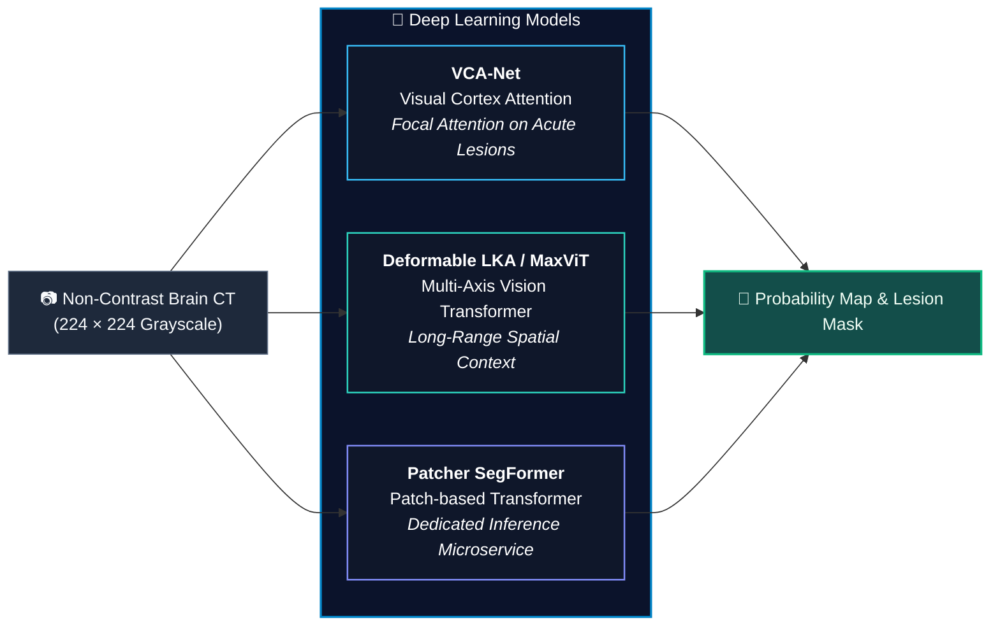
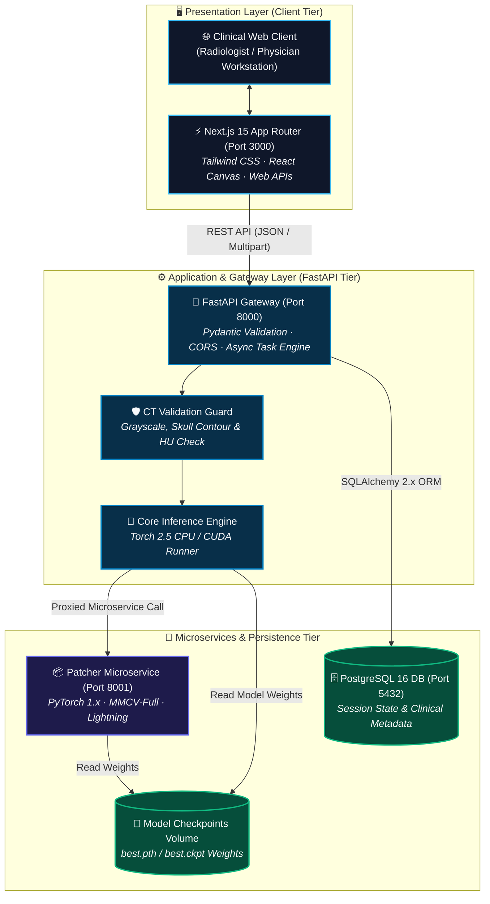
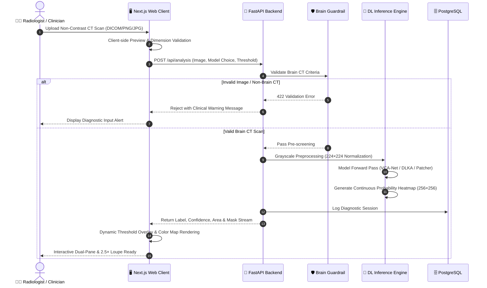

<div align="center">

<!-- Animated Medical Hero Banner -->


<br/><br/>

[](https://nextjs.org/)
[](https://fastapi.tiangolo.com/)
[](https://pytorch.org/)
[](https://www.postgresql.org/)
[](https://www.docker.com/)
[](https://www.typescriptlang.org/)
[](https://tailwindcss.com/)

<br/>

<p align="center">
  <b>A Clinical-Grade Neuro-Imaging Decision Support Platform</b><br/>
  <i>Deep Learning-Powered Lesion Segmentation on Non-Contrast Brain Computed Tomography (NCCT)</i>
</p>

<!-- Animated Divider -->


</div>

---

## 📋 Executive Overview

**NU Stroke Scan** เป็นระบบช่วยตัดสินใจทางการแพทย์ (Clinical Decision Support System - CDSS) สำหรับงานวิจัยระดับปริญญานิพนธ์ (Senior Research Thesis) ด้านการแพทย์และปัญญาประดิษฐ์ทางการถ่ายภาพรังสีวิทยาทางระบบประสาท (Neuro-Radiology AI) 

ตัวระบบได้รับการออกแบบและพัฒนาขึ้นเพื่อสนับสนุนแพทย์ รังสีแพทย์ และบุคลากรทางการแพทย์ในการตรวจหา ระบุขอบเขต และประเมินรอยโรคหลอดเลือดสมอง (Stroke Lesions) จากภาพถ่ายเอกซเรย์คอมพิวเตอร์สมองชนิดไม่ฉีดสารทึบรังสี (**Non-Contrast Brain CT**) แบบอัตโนมัติ โดยผสมผสานโมเดล **Deep Learning** ระดับ State-of-the-Art (SOTA) เข้ากับหน้าต่างการตรวจวินิจฉัย (Clinical Diagnostic Interface) ที่ตอบสนองแบบ Real-time และมีความแม่นยำสูง

---

## ✨ Key Capabilities & Clinical Features

<div align="center">

| 🔬 **Deep Learning Intelligence** | 🖥️ **Clinical Diagnostic Workspace** | 🛡️ **Medical Image Guardrails** |
| :--- | :--- | :--- |
| • **3 SOTA AI Model Architectures**<br/>• Sub-millimeter pixel segmentation<br/>• Dynamic lesion threshold calibration<br/>• Real-time confidence quantification | • **2.5× Diagnostic Loupe Magnifier**<br/>• Synchronized Dual-Viewport Zoom & Pan<br/>• Neumorphic tactile brightness/contrast<br/>• Calibrated anatomical grid overlay | • Strict Non-Contrast CT verification<br/>• Skull-to-Brain ratio boundary checks<br/>• Hounsfield Unit distribution check<br/>• Rejection of invalid / non-brain inputs |

</div>

<br/>

### 🔍 1. Interactive 2.5× Diagnostic Loupe
- **Cursor Tracking**: คลิกขวาเพื่อเปิดแว่นขยายระดับตรวจวินิจฉัย (Magnifying Loupe) กำลังขยาย **2.5×** ติดตามตำแหน่งเคอร์เซอร์ของเมาส์แบบ Real-time
- **Microvascular Inspection**: ช่วยให้แพทย์ตรวจสอบขอบเขตขอบรอยโรค (Lesion Boundaries) และเนื้อเยื่อสมองที่มีความเปรียบต่างต่ำ (Low-Contrast Ischemic Penumbra) ได้อย่างละเอียดแม่นยำ

### 🔄 2. Synchronized Dual-Pane Viewport
- **Dual-Pane View**: แสดงภาพต้นฉบับ (**Original NCCT Scan**) ควบคู่กับภาพผลการแบ่งส่วนรอยโรค (**AI Lesion Overlay**)
- **1:1 Synchronized Pan & Zoom**: การเลื่อนตำแหน่ง (Pan) และการซูม (0.5× ถึง 4.0×) ทำงานพร้อมกันทั้งสองฝั่งแบบ 1:1 พร้อมปุ่มสลับตารางวัดสัดส่วน (**Anatomical Grid Reticle**)

### 🎛️ 3. Tactile Stepped Neumorphic Controls
- **Medical Windowing**: สไลเดอร์ปรับค่า Brightness และ Contrast ด้วยสไตล์ Neumorphic ขั้นบันได
- **Dynamic Mask Opacity & Threshold**: ปรับระดับความทึบแสงของ Mask และเกณฑ์การตัดสินใจของโมเดล (Decision Threshold 0% – 100%) แบบ Live-rendered บน Client Canvas

---

<!-- Animated Divider -->
<div align="center">
  
</div>

## 🧠 Supported Deep Learning Architectures

ระบบผสานรวมโมเดลโครงข่ายประสาทเทียมชั้นสูง 3 สถาปัตยกรรมที่ผ่านการเทรนและทดสอบกับชุดข้อมูลภาพ CT สมอง:



1. **VCA-Net (`vcanet`)**:
   - สถาปัตยกรรม **Visual Cortex Attention Network** จำลองกลไกการเพ่งความสนใจของเปลือกสมองส่วนการมองเห็น มุ่งเน้นการตรวจจับรอยโรคขาดเลือดระยะเฉียบพลันที่มีลักษณะ Hypodense จางๆ
2. **Deformable LKA (`dlka`)**:
   - การผสานระหว่าง **MaxViT (Multi-Axis Vision Transformer)** ร่วมกับ **Deformable Large Kernel Attention** ช่วยเก็บข้อมูลบริบทเชิงพื้นที่ระยะไกล (Long-Range Spatial Dependencies) และปรับรูปทรงตามขอบรอยโรคที่มีความบิดเบี้ยวตามกายวิภาค
3. **Patcher SegFormer (`patcher`)**:
   - โมเดล Patch-based SegFormer ที่ทำงานบน **MMCV & PyTorch Lightning** โดยแยกทำงานเป็นอิสระในรูปแบบ **Microservice Architecture** เพื่อรองรับ Dependency เฉพาะทางได้อย่างไร้รอยต่อ

---

<!-- Animated Divider -->
<div align="center">
  
</div>

## 🏗️ System Architecture

ระบบถูกออกแบบด้วยสถาปัตยกรรม **3-Tier Enterprise Clinical Architecture** ภายใต้สภาพแวดล้อม Containerized Docker Network:



---

<!-- Animated Divider -->
<div align="center">
  
</div>

## 🔄 Diagnostic Inference Pipeline

กระบวนการประมวลผลตั้งแต่การรับภาพจนถึงการสร้างภาพผลลัพธ์ทางการแพทย์:



---

<!-- Animated Divider -->
<div align="center">
  
</div>

## 🛠️ Tech Stack & Architecture Matrix

| Domain | Technology / Library | Description |
| :--- | :--- | :--- |
| **Frontend UI/UX** | **Next.js 15 (App Router)** | React 19, Server & Client Components, Dynamic Canvas Rendering |
| **Styling & Icons** | **Tailwind CSS 3.4** | Modern Medical Dark/Light Neumorphic Aesthetic, Vector SVG Icons |
| **Backend API** | **FastAPI 0.115** | High-performance Asynchronous Python API, OpenAPI / Swagger Docs |
| **AI / Deep Learning** | **PyTorch 2.5 / MMCV** | GPU/CPU Tensor Acceleration, Vision Transformers & Attention Nets |
| **Database & ORM** | **PostgreSQL 16 & SQLAlchemy 2.x** | Enterprise ACID Relational Storage, Alembic Schema Migrations |
| **Containerization** | **Docker & Docker Compose** | Multi-container isolation, Microservices proxy network |

---

<!-- Animated Divider -->
<div align="center">
  
</div>

## ⚡ Quick Start & Deployment Guide

### Prerequisites
- [Docker](https://www.docker.com/) & Docker Compose (v2.20+)
- Node.js (v20+) & Python 3.12+ (สำหรับกรณี Local Development)

### 1. One-Click Launch with Docker Compose (Recommended)

```bash
# 1. Clone repository
git clone https://github.com/Cell1991/nu-stroke-scan.git
cd nu-stroke-scan

# 2. Setup environment variables
cp .env.example .env

# 3. Build and launch all clinical services
docker compose up --build
```

### 2. Service Access Endpoints

| Service | Protocol / Port | URL |
| :--- | :--- | :--- |
| 🖥️ **Clinical Web UI** | HTTP / 3000 | [`http://localhost:3000`](http://localhost:3000) |
| 🚀 **FastAPI Backend Gateway** | HTTP / 8000 | [`http://localhost:8000`](http://localhost:8000) |
| 📖 **Interactive Swagger UI** | HTTP / 8000 | [`http://localhost:8000/docs`](http://localhost:8000/docs) |
| 📑 **ReDoc API Documentation** | HTTP / 8000 | [`http://localhost:8000/redoc`](http://localhost:8000/redoc) |
| 🗄️ **PostgreSQL Database** | TCP / 5432 | `localhost:5432` |

---

<!-- Animated Divider -->
<div align="center">
  
</div>

## 📡 REST API Reference

### 1. Run Stroke Lesion Segmentation Analysis
```http
POST /api/analysis
Content-Type: multipart/form-data
```

| Parameter | Type | Required | Default | Description |
| :--- | :--- | :--- | :--- | :--- |
| `file` | `Binary File` | **Yes** | — | Brain CT image (`PNG`, `JPG`, `DICOM slice`) |
| `model` | `string` | No | `vcanet` | Model ID (`vcanet`, `dlka`, `patcher`) |
| `threshold` | `float` | No | `0.50` | Binary segmentation cutoff (0.0 to 1.0) |

**Sample Response:**
```json
{
  "detected": true,
  "label": "Ischemic Stroke Lesion Detected",
  "confidence": 0.942,
  "lesion_area_pct": 3.85,
  "model_label": "VCA-Net (Visual Cortex Attention)",
  "mask_url": "data:image/png;base64,iVBORw0KGgoAAAANSUhEUgAAA...",
  "input_size": [224, 224],
  "processing_time_ms": 142.5
}
```

### 2. Query Supported Model Architectures
```http
GET /api/analysis/models
```

---

<!-- Animated Divider -->
<div align="center">
  
</div>

## 👥 Research & Development Team

<div align="center">
  <p><b>🎓 Undergraduate Graduation Research Project (Senior Thesis)</b><br/>
  <i>Computer Engineering &amp; Artificial Intelligence for Medical Imaging</i></p>

  <table align="center" style="border: none; background: transparent;">
    <tr style="border: none; background: transparent;">
      <td align="center" style="border: none; padding: 12px; background: transparent;">
        <a href="https://github.com/Cell1991">
          
        </a>
      </td>
      <td align="center" style="border: none; padding: 12px; background: transparent;">
        <a href="https://github.com/kanin-mate">
          
        </a>
      </td>
    </tr>
  </table>

  <br/>

  <table align="center" width="85%">
    <thead>
      <tr>
        <th align="left">Researcher</th>
        <th align="left">Primary Research Responsibilities</th>
        <th align="left">Key Focus Areas</th>
      </tr>
    </thead>
    <tbody>
      <tr>
        <td><b>Chu</b><br/><code>@Cell1991</code></td>
        <td><b>Lead UI/UX Architect &amp; Full-Stack System Engineer</b></td>
        <td>Next.js 15 Client Architecture, 2.5× Diagnostic Loupe, Dual Synced Viewport, Neumorphic UI, Microservices Integration &amp; Docker Infrastructure.</td>
      </tr>
      <tr>
        <td><b>Kanin Mate</b><br/><code>@Rednoselittledog</code></td>
        <td><b>Lead AI &amp; Deep Learning Research Scientist</b></td>
        <td>Neuro-Imaging Model Pipelines, VCA-Net, Deformable LKA / MaxViT, Patcher SegFormer, PyTorch &amp; MMCV Microservices, Model Weights &amp; Evaluation.</td>
      </tr>
    </tbody>
  </table>
</div>

<br/>

---

<div align="center">

> [!NOTE]
> **Clinical Research Notice & Disclaimer**: This software application is developed for academic research, medical imaging evaluation, and clinical decision support purposes. It is intended to assist medical professionals and should not replace certified radiological diagnosis.

<br/>

<sub>© 2026 NU Stroke Scan Research Project · Designed with Precision for Medical AI Excellence</sub>

</div>
