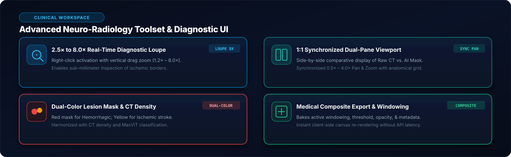
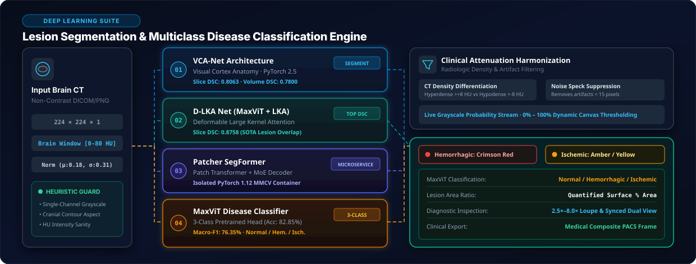
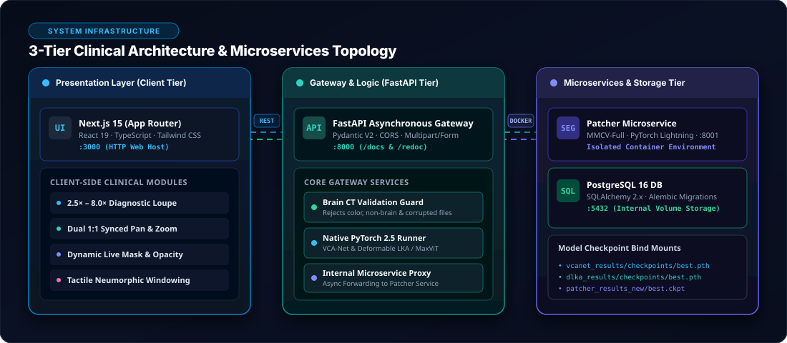
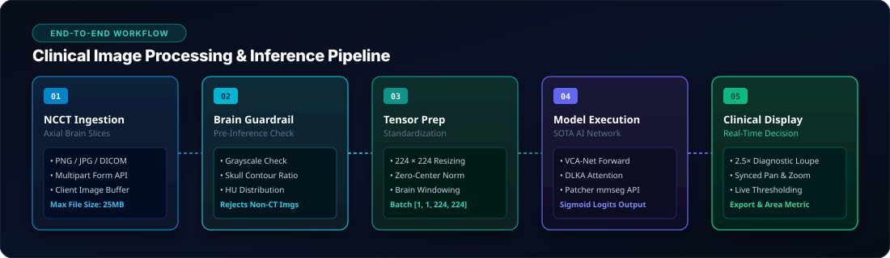
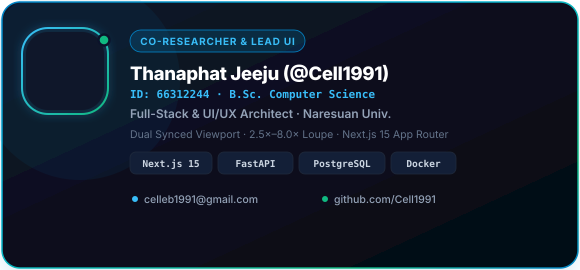
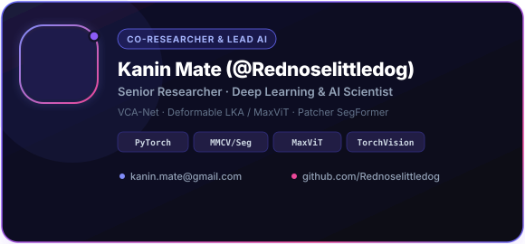

<div align="center">

<!-- Animated Medical Hero Banner -->


<br/><br/>

[](https://nextjs.org/)
[](https://fastapi.tiangolo.com/)
[](https://pytorch.org/)
[](https://www.postgresql.org/)
[](https://www.docker.com/)
[](https://www.typescriptlang.org/)
[](https://tailwindcss.com/)

<br/>

<p align="center">
  <b>A Clinical-Grade Neuro-Imaging Decision Support Platform</b><br/>
  <i>Deep Learning-Powered Lesion Segmentation on Non-Contrast Brain Computed Tomography (NCCT)</i>
</p>

<!-- Animated Medical Divider -->


</div>

---

## Executive Overview

**NU Stroke Scan** is a **Clinical Decision Support System (CDSS)** developed as an undergraduate graduation research thesis in biomedical artificial intelligence and neuro-radiological computer vision.

The system empowers neurologists, radiologists, and emergency clinicians to rapidly detect, delineate, and quantify acute stroke lesions on **Non-Contrast Brain Computed Tomography (NCCT)** scans with sub-millimeter precision. By orchestrating multiple cutting-edge deep learning architectures with an ultra-responsive, zero-latency clinical workspace, **NU Stroke Scan** bridges the critical gap between academic neural networks and frontline diagnostic radiology.

---

<!-- Animated Medical Divider -->
<div align="center">
  
</div>

## Clinical Diagnostic Workspace

<!-- Custom High-Definition SVG Features Matrix -->


<br/>

### 1. Real-Time 2.5× to 8.0× Diagnostic Loupe
- **Cursor Tracking**: Right-click anywhere on the scan to activate an ultra-high-definition circular magnifying loupe that tracks the cursor in real-time.
- **Vertical Drag Zoom**: Left-click and drag vertically within the active loupe to dynamically scale the magnification from **1.2× up to 8.0×**, allowing meticulous inspection of penumbral microvasculature and low-contrast hypodense borders.

### 2. 1:1 Synchronized Dual-Pane Viewport
- **Comparative Side-by-Side**: Dual viewport displaying the raw NCCT slice and the AI-generated lesion probability mask in lockstep.
- **Synchronized Navigation**: Panning and scaling (0.5× to 4.0×) are bidirectionally synchronized between both viewports with an optional anatomical reticle grid for precise coordinate referencing.

### 3. Clinical Non-Contrast CT Guardrails
- **Automated Validation**: Multi-stage pre-inference heuristic validation checks for grayscale single-channel integrity, Hounsfield Unit (HU) distribution, and skull contour aspect ratios.
- **Artifact Rejection**: Instantly rejects corrupted files, colored synthetic illustrations, non-brain anatomical regions, and invalid non-axial slices before passing tensors to neural networks.

### 4. Stepped Neumorphic Windowing & Dynamic Thresholding
- **Radiological Windowing**: Tactile stepped slider controls for brightness, contrast, and mask alpha blending.
- **Zero-Latency Mask Cutoff**: Adjust model decision thresholds (0% to 100%) on the fly with instantaneous client-side Canvas rendering, eliminating redundant server round-trips.

---

<!-- Animated Medical Divider -->
<div align="center">
  
</div>

## Deep Learning Architecture Suite

<!-- Custom High-Definition SVG Models Suite -->


<br/>

The platform natively supports three research-backed deep learning architectures, each tailored for distinct morphological lesion characteristics:

| Architecture | Backbone & Attention Mechanism | Key Clinical Specialization | Runtime Environment |
| :--- | :--- | :--- | :--- |
| **VCA-Net** | Visual Cortex Attention Network | Focal attention targeting acute, low-contrast ischemic infarcts | PyTorch 2.5 (FastAPI Gateway) |
| **Deformable LKA** | MaxViT + Deformable Large Kernel Attention | Long-range spatial context with anatomical contour deformation | PyTorch 2.5 (FastAPI Gateway) |
| **Patcher SegFormer** | Patch-based SegFormer Transformer | High-resolution micro-lesion patch segmentation | MMCV / PyTorch Lightning Microservice |

---

<!-- Animated Medical Divider -->
<div align="center">
  
</div>

## 3-Tier System Architecture

<!-- Custom High-Definition SVG System Architecture -->


<br/>

The application is structured into three enterprise tiers containerized within an isolated Docker network:

1. **Presentation Tier (`frontend`)**: Next.js 15 App Router running React 19, TypeScript, Tailwind CSS, and optimized HTML5 Canvas renderers on port `3000`.
2. **Gateway & Logic Tier (`backend`)**: FastAPI asynchronous application on port `8000` handling Pydantic V2 request validation, clinical guardrails, native PyTorch inference runners, and proxy routing.
3. **Microservices & Persistence Tier**:
   - **Patcher Service**: Dedicated containerized MMCV-Full and PyTorch Lightning inference server on port `8001`.
   - **PostgreSQL 16**: Relational storage on port `5432` managed via SQLAlchemy 2.x ORM and Alembic schema migrations.
   - **Model Weights Volume**: Checkpoint bind mounts preserving trained model weights (`best.pth`, `best.ckpt`).

---

<!-- Animated Medical Divider -->
<div align="center">
  
</div>

## Clinical Inference Pipeline

<!-- Custom High-Definition SVG Pipeline Flow -->


<br/>

The end-to-end diagnostic workflow executes seamlessly across five deterministic stages:

1. **Ingestion**: The clinician uploads an axial Non-Contrast Brain CT image (`PNG`, `JPG`, or `DICOM` slice) via the multipart interface.
2. **Validation**: The Brain Guardrail engine verifies cranial morphology, single-channel grayscale distribution, and Hounsfield Unit consistency.
3. **Preprocessing**: The scan is standardized to $224 \times 224 \times 1$, normalized with zero-center windowing, and formatted as a 4D batch tensor.
4. **Model Execution**: The selected neural network computes the forward pass, emitting raw logits transformed via continuous Sigmoid probability scaling.
5. **Presentation**: The client receives detection metrics, confidence scores, and probability maps, dynamically rendering overlays for immediate clinical review.

---

<!-- Animated Medical Divider -->
<div align="center">
  
</div>

## REST API Reference

### 1. Perform Stroke Lesion Analysis
```http
POST /api/analysis
Content-Type: multipart/form-data
```

#### Request Parameters
| Field | Type | Required | Default | Description |
| :--- | :--- | :--- | :--- | :--- |
| `file` | `Binary File` | **Yes** | — | Non-contrast brain CT scan (`PNG`, `JPG`, `DICOM slice`) |
| `model` | `string` | No | `vcanet` | Model identifier: `vcanet`, `dlka`, or `patcher` |
| `threshold` | `float` | No | `0.50` | Binary segmentation cutoff threshold ($0.0 \le t \le 1.0$) |

#### Response Schema
```json
{
  "detected": true,
  "label": "Ischemic Stroke Lesion Detected",
  "confidence": 0.942,
  "lesion_area_pct": 3.85,
  "model_label": "VCA-Net (Visual Cortex Attention)",
  "mask_url": "data:image/png;base64,iVBORw0KGgoAAAANSUhEUgAAA...",
  "input_size": [224, 224],
  "processing_time_ms": 142.5
}
```

### 2. Retrieve Available Deep Learning Models
```http
GET /api/analysis/models
```

---

<!-- Animated Medical Divider -->
<div align="center">
  
</div>

## Quick Start & Deployment Guide

### Prerequisites
- [Docker Engine](https://docs.docker.com/engine/install/) & Docker Compose (v2.20+)
- Node.js (v20+) & Python 3.12+ *(for local non-containerized development)*

### 1. Production Docker Launch (Recommended)

```bash
# Clone the research repository
git clone https://github.com/Cell1991/nu-stroke-scan.git
cd nu-stroke-scan

# Configure environment variables
cp .env.example .env

# Build and start all clinical microservices
docker compose up --build
```

### 2. Service Endpoints

| Service Tier | Protocol & Port | Endpoint URL |
| :--- | :--- | :--- |
| **Clinical Web UI** | HTTP / 3000 | [`http://localhost:3000`](http://localhost:3000) |
| **FastAPI Backend Gateway** | HTTP / 8000 | [`http://localhost:8000`](http://localhost:8000) |
| **Interactive Swagger UI** | HTTP / 8000 | [`http://localhost:8000/docs`](http://localhost:8000/docs) |
| **ReDoc Documentation** | HTTP / 8000 | [`http://localhost:8000/redoc`](http://localhost:8000/redoc) |
| **PostgreSQL Database** | TCP / 5432 | `localhost:5432` |

---

<!-- Animated Medical Divider -->
<div align="center">
  
</div>

## Research & Development Team

<div align="center">
  <p><b>Undergraduate Graduation Research Project (Senior Thesis)</b><br/>
  <i>Department of Computer Engineering · Neuro-Radiology &amp; Medical AI</i></p>

  <table align="center" style="border: none; background: transparent;">
    <tr style="border: none; background: transparent;">
      <td align="center" style="border: none; padding: 12px; background: transparent;">
        <a href="https://github.com/Cell1991">
          
        </a>
      </td>
      <td align="center" style="border: none; padding: 12px; background: transparent;">
        <a href="https://github.com/Rednoselittledog">
          
        </a>
      </td>
    </tr>
  </table>

  <br/>

  <table align="center" width="90%">
    <thead>
      <tr>
        <th align="left">Co-Researcher</th>
        <th align="left">Primary Academic &amp; Engineering Role</th>
        <th align="left">Key Research Contributions</th>
      </tr>
    </thead>
    <tbody>
      <tr>
        <td><b>Chu</b><br/><code>@Cell1991</code></td>
        <td><b>Lead UI/UX Architect &amp; Full-Stack System Engineer</b></td>
        <td>Architected the Next.js 15 clinical application, 2.5×–8.0× diagnostic loupe magnifier, 1:1 synchronized dual-pane viewport, neumorphic windowing system, FastAPI gateway integration, and multi-container Docker infrastructure.</td>
      </tr>
      <tr>
        <td><b>Kanin Mate</b><br/><code>@Rednoselittledog</code></td>
        <td><b>Lead AI &amp; Deep Learning Research Scientist</b></td>
        <td>Engineered neural network pipelines, trained and optimized VCA-Net, Deformable LKA / MaxViT, and Patcher SegFormer architectures, built MMCV microservice containers, and conducted quantitative lesion segmentation benchmarks.</td>
      </tr>
    </tbody>
  </table>
</div>

<br/>

---

<div align="center">

> [!NOTE]
> **Clinical Research Notice & Disclaimer**: This software application is developed exclusively for academic research, medical imaging evaluation, and clinical decision support purposes. It is intended to assist qualified healthcare professionals and should not replace certified radiological diagnosis.

<br/>

<sub>© 2026 NU Stroke Scan Research Project · Designed with Precision for Medical AI Excellence</sub>

</div>
